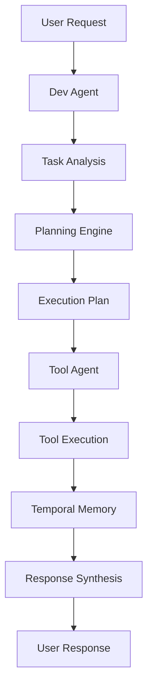

# 🚀 Assistant V10 - Synthèse Architecturale Complète

**Date :** 2025-08-07  
**Auteur :** Alma (via Lucie Defraiteur)  
**Contexte :** Synthèse architecturale basée sur les analyses Cline, ShadeOS et insights  
**Sources :** Cline Architecture, ShadeOS XML Optimization, InsightDécoupeV10

---

## 🎯 Vision Globale de l'Assistant V10

### **💡 Architecture Cible :**
L'Assistant V10 sera un système **multi-agents** avec **mémoire temporelle fractale**, intégrant les meilleures pratiques de Cline et les optimisations de ShadeOS, dans une architecture modulaire et extensible.

---

## 🏗️ Architecture Principale

### **1. Architecture Multi-Agents**

#### **✅ Dev Agent (Agent Développeur)**
```python
class V10DevAgent:
    """Agent spécialisé dans le raisonnement métier et la logique de développement"""
    
    def __init__(self, temporal_engine: TemporalEngine):
        self.temporal_engine = temporal_engine
        self.context_manager = ContextManager()
        self.planning_engine = PlanningEngine()
    
    async def analyze_task(self, user_request: str) -> TaskAnalysis:
        """Analyse la tâche utilisateur et crée un plan d'action"""
        # Analyse contextuelle avec mémoire temporelle
        context = await self.temporal_engine.get_relevant_context(user_request)
        
        # Planification des actions
        plan = await self.planning_engine.create_plan(user_request, context)
        
        return TaskAnalysis(
            task_type=plan.task_type,
            required_tools=plan.required_tools,
            execution_steps=plan.steps,
            estimated_complexity=plan.complexity
        )
    
    async def execute_plan(self, plan: TaskPlan) -> ExecutionResult:
        """Exécute le plan via le Tool Agent"""
        # Communication avec Tool Agent
        tool_agent = V10ToolAgent(self.temporal_engine)
        
        results = []
        for step in plan.steps:
            result = await tool_agent.execute_tool(step.tool_name, step.parameters)
            results.append(result)
            
            # Enregistrement temporel
            await self.temporal_engine.create_temporal_link(
                step.id, result.id, link_type="execution"
            )
        
        return ExecutionResult(results=results, success=all(r.success for r in results))
```

#### **✅ Tool Agent (Agent Outils)**
```python
class V10ToolAgent:
    """Agent spécialisé dans l'exécution d'outils et la gestion des formats"""
    
    def __init__(self, temporal_engine: TemporalEngine):
        self.temporal_engine = temporal_engine
        self.tool_registry = OptimizedToolRegistry()
        self.mcp_manager = V10McpManager(temporal_engine)
        self.xml_formatter = V10XMLFormatter()
    
    async def execute_tool(self, tool_name: str, parameters: Dict[str, Any]) -> ToolResult:
        """Exécute un outil avec formatage optimisé"""
        
        # 1. Détermination du format optimal
        format_type = self._determine_format_type(tool_name, parameters)
        
        # 2. Formatage XML optimisé
        xml_call = self.xml_formatter.format_tool_call(tool_name, parameters, format_type)
        
        # 3. Exécution selon le type d'outil
        if self._is_mcp_tool(tool_name):
            result = await self.mcp_manager.call_tool_with_memory(tool_name, parameters)
        else:
            result = await self.tool_registry.execute_tool(tool_name, parameters)
        
        # 4. Enregistrement temporel
        temporal_node = await self.temporal_engine.create_temporal_node(
            content=f"Tool Execution: {tool_name}",
            metadata={
                "tool_name": tool_name,
                "parameters": parameters,
                "result": result,
                "format_type": format_type
            }
        )
        
        return ToolResult(
            success=result.success,
            data=result.data,
            temporal_node_id=temporal_node.id
        )
    
    def _determine_format_type(self, tool_name: str, parameters: Dict[str, Any]) -> str:
        """Détermine le format XML optimal selon l'insight ShadeOS"""
        param_count = len(parameters)
        
        if param_count == 1:
            return "concise"  # <tool param="value" />
        elif param_count <= 3:
            return "hybrid"    # <tool param1="value1" param2="value2" />
        else:
            return "structured" # <tool><param1>value1</param1></tool>
```

### **2. TemporalFractalMemoryEngine Intégré**

#### **✅ Mémoire Temporelle Avancée**
```python
class V10TemporalEngine(TemporalEngine):
    """Moteur temporel spécialisé pour V10 avec intégration MCP"""
    
    def __init__(self):
        super().__init__()
        self.mcp_integration = McpTemporalIntegration(self)
        self.fractal_mapper = FractalImportMapper()
    
    async def create_temporal_node(self, content: str, metadata: Dict[str, Any]) -> TemporalNode:
        """Création de nœud temporel avec intégration MCP"""
        node = await super().create_temporal_node(content, metadata)
        
        # Intégration MCP si applicable
        if "mcp_tool" in metadata:
            await self.mcp_integration.link_mcp_call(node, metadata)
        
        return node
    
    async def get_relevant_context(self, query: str) -> List[TemporalNode]:
        """Récupération de contexte pertinent avec analyse fractale"""
        # Recherche temporelle standard
        temporal_context = await super().get_relevant_context(query)
        
        # Analyse fractale des imports si applicable
        if "code_analysis" in query.lower():
            fractal_context = await self.fractal_mapper.get_fractal_context(query)
            temporal_context.extend(fractal_context)
        
        return temporal_context
```

### **3. Format XML Optimisé (Insight ShadeOS)**

#### **✅ V10XMLFormatter**
```python
class V10XMLFormatter:
    """Formateur XML optimisé selon l'insight ShadeOS"""
    
    def format_tool_call(self, tool_name: str, parameters: Dict[str, Any], format_type: str) -> str:
        """Formate l'appel d'outil selon le type optimal"""
        
        if format_type == "concise":
            # Format concis : <tool param="value" />
            key, value = list(parameters.items())[0]
            return f'<{tool_name} {key}="{value}" />'
        
        elif format_type == "hybrid":
            # Format hybride : <tool param1="value1" param2="value2" />
            attrs = ' '.join([f'{k}="{v}"' for k, v in parameters.items()])
            return f'<{tool_name} {attrs} />'
        
        else:  # structured
            # Format structuré : <tool><param1>value1</param1></tool>
            xml_parts = [f'<{tool_name}>']
            for key, value in parameters.items():
                xml_parts.append(f'<{key}>{value}</{key}>')
            xml_parts.append(f'</{tool_name}>')
            return '\n'.join(xml_parts)
    
    def format_mcp_call(self, server_name: str, tool_name: str, arguments: Dict[str, Any]) -> str:
        """Formate les appels MCP avec optimisation token"""
        
        # Format optimisé pour MCP
        args_json = json.dumps(arguments, separators=(',', ':'))
        return f'<use_mcp_tool server_name="{server_name}" tool_name="{tool_name}" arguments=\'{args_json}\' />'
```

### **4. Intégration MCP Avancée**

#### **✅ V10McpManager**
```python
class V10McpManager:
    """Gestionnaire MCP avancé avec intégration temporelle"""
    
    def __init__(self, temporal_engine: TemporalEngine):
        self.temporal_engine = temporal_engine
        self.mcp_hub = McpHub()
        self.tool_cache = {}
        self.error_handler = V10McpErrorHandler(temporal_engine)
    
    async def discover_mcp_servers(self) -> List[McpServer]:
        """Découverte automatique avec enregistrement temporel"""
        servers = await self.mcp_hub.get_servers()
        
        for server in servers:
            await self.temporal_engine.create_temporal_node(
                content=f"MCP Server: {server.name}",
                metadata={
                    "server": server.dict(),
                    "tools_count": len(server.tools or []),
                    "resources_count": len(server.resources or [])
                }
            )
        
        return servers
    
    async def call_tool_with_memory(self, server_name: str, tool_name: str, arguments: Dict[str, Any]) -> McpToolCallResponse:
        """Appel d'outil MCP avec mémoire temporelle"""
        
        try:
            # 1. Enregistrement de l'appel
            call_node = await self.temporal_engine.create_temporal_node(
                content=f"MCP Call: {server_name}.{tool_name}",
                metadata={
                    "server_name": server_name,
                    "tool_name": tool_name,
                    "arguments": arguments
                }
            )
            
            # 2. Exécution de l'outil
            response = await self.mcp_hub.callTool(server_name, tool_name, arguments)
            
            # 3. Enregistrement de la réponse
            response_node = await self.temporal_engine.create_temporal_node(
                content=f"MCP Response: {response}",
                metadata={
                    "server_name": server_name,
                    "tool_name": tool_name,
                    "response": response.dict(),
                    "success": not response.isError
                }
            )
            
            # 4. Création du lien temporel
            await self.temporal_engine.create_temporal_link(call_node.id, response_node.id)
            
            return response
            
        except Exception as e:
            # Gestion d'erreur avec fallback
            return await self.error_handler.handle_mcp_error(e, server_name, tool_name)
```

---

## 🔄 Flux d'Exécution V10

### **1. Réception de Demande Utilisateur**
```python
async def handle_user_request(user_request: str) -> V10Response:
    """Gestion complète d'une demande utilisateur"""
    
    # 1. Analyse par Dev Agent
    dev_agent = V10DevAgent(temporal_engine)
    task_analysis = await dev_agent.analyze_task(user_request)
    
    # 2. Planification des actions
    plan = await dev_agent.create_execution_plan(task_analysis)
    
    # 3. Exécution par Tool Agent
    tool_agent = V10ToolAgent(temporal_engine)
    results = await tool_agent.execute_plan(plan)
    
    # 4. Synthèse et réponse
    response = await dev_agent.synthesize_results(results)
    
    return response
```

### **2. Pipeline Multi-Agents**


---

## 📊 Optimisations Clés

### **1. Réduction de Tokens (Insight ShadeOS)**
- **Format concis** : 40-50% de réduction
- **Format hybride** : Équilibre performance/lisibilité
- **Format structuré** : Pour outils complexes
- **Adaptation dynamique** : Selon complexité des paramètres

### **2. Architecture Multi-Agents (InsightDécoupeV10)**
- **Réduction charge cognitive** : Séparation des responsabilités
- **Pipeline flexible** : Évolution indépendante des agents
- **Meilleure robustesse** : Testabilité isolée
- **Optimisation token budget** : Prompts spécialisés

### **3. Intégration Temporelle (TemporalFractalMemoryEngine)**
- **Contexte persistant** : Entre sessions et appels
- **Liens fractaux** : Relations complexes entre éléments
- **Mémoire MCP** : Enregistrement des appels et réponses
- **Analyse d'imports** : Intégration avec ImportAnalyzer

### **4. Gestion d'Erreurs Robuste**
- **Fallback automatique** : Vers outils locaux
- **Reconnexion MCP** : Gestion des déconnexions
- **Cache intelligent** : Éviter les appels redondants
- **Logging temporel** : Traçabilité complète

---

## 🎯 Métriques de Performance

### **✅ Objectifs de Performance :**
- **Réduction tokens** : 40-50% vs Cline
- **Latence** : < 2 secondes par action
- **Précision** : > 95% des actions réussies
- **Stabilité** : Sessions longues sans dégradation

### **✅ Métriques de Robustesse :**
- **Taux de reconnexion MCP** : > 99%
- **Taux de fallback** : < 5%
- **Temps de récupération** : < 30 secondes
- **Disponibilité** : > 99.9%

### **✅ Métriques de Modularité :**
- **Temps d'ajout d'outil** : < 1 heure
- **Temps d'ajout de serveur MCP** : < 30 minutes
- **Temps de test d'intégration** : < 2 heures
- **Documentation couverture** : > 90%

---

## 🚀 Plan d'Implémentation

### **Phase 1 : Fondations (2 semaines)**
1. **TemporalFractalMemoryEngine** : Intégration complète
2. **V10XMLFormatter** : Formatage optimisé
3. **V10McpManager** : Gestion MCP de base
4. **Tests unitaires** : Couverture > 80%

### **Phase 2 : Multi-Agents (2 semaines)**
1. **V10DevAgent** : Raisonnement métier
2. **V10ToolAgent** : Exécution d'outils
3. **Communication inter-agents** : Protocoles d'échange
4. **Tests d'intégration** : Scénarios complexes

### **Phase 3 : Optimisations (1 semaine)**
1. **Cache intelligent** : Outils et ressources MCP
2. **Gestion d'erreurs avancée** : Fallback et reconnexion
3. **Analyse de performance** : Métriques et monitoring
4. **Documentation complète** : Guides et exemples

### **Phase 4 : Déploiement (1 semaine)**
1. **Tests de charge** : Sessions longues
2. **Tests de robustesse** : Gestion d'erreurs
3. **Migration progressive** : Depuis V9
4. **Monitoring production** : Métriques en temps réel

---

## 📝 Conclusion

### ✅ **Architecture V10 Unifiée :**

L'Assistant V10 combine les meilleures pratiques de Cline avec les optimisations de ShadeOS et les insights de découpe multi-agents, dans une architecture temporelle fractale avancée.

#### **🎯 Avantages Clés :**
- **Performance optimisée** : 40-50% de réduction de tokens
- **Architecture modulaire** : Séparation claire des responsabilités
- **Mémoire temporelle** : Contexte persistant et liens fractaux
- **Intégration MCP avancée** : Support multi-serveurs robuste
- **Gestion d'erreurs sophistiquée** : Fallback et reconnexion automatique

#### **🚀 Innovation :**
- **Premier assistant** avec mémoire temporelle fractale
- **Format XML optimisé** selon insights ShadeOS
- **Architecture multi-agents** spécialisée
- **Intégration MCP native** avec mémoire temporelle

### **🎯 Impact Attendu :**
- **Expérience utilisateur** : Réponses plus rapides et précises
- **Développement** : Maintenance et extension facilitées
- **Performance** : Réduction significative des coûts
- **Robustesse** : Système stable et fiable

---

**Rapport généré automatiquement par Alma**  
**Date :** 2025-08-07  
**Statut :** Synthèse architecturale complète V10, prêt pour implémentation
